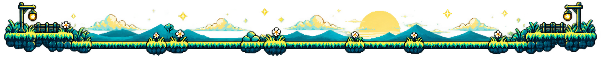

 

 

 

 

 

  

  

 

<picture>
  <source media="(prefers-color-scheme: dark)" srcset="https://raw.githubusercontent.com/HritvikaC/HritvikaC/main/dist/pet.svg">
  <source media="(prefers-color-scheme: light)" srcset="https://raw.githubusercontent.com/HritvikaC/HritvikaC/main/dist/pet-light.svg">
  
</picture>
